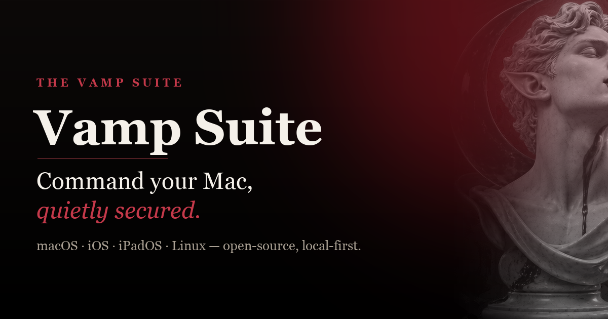

<div align="center">



# Vamp Suite

### Private AI, Mac streaming, remote control, and terminal access.

Local-first software for macOS, iPhone, and iPad. Connect over a trusted LAN or
private Tailscale network—with visible approval for every new device and no
hosted relay.

[](https://github.com/Mesutcydev/vamp-suite/actions/workflows/ci.yml)
[](https://thevamp.app/)
[](https://github.com/Mesutcydev/vamp-suite/releases/latest)
[](LICENSE)

[Explore the suite](https://thevamp.app/) · [Download](https://thevamp.app/#download) · [Install guide](docs/INSTALL.md) · [Security](SECURITY.md)

</div>

## Start here

1. Install **Vamp Sync** on the Mac you want to reach.
2. Install **one client** on your other device:

| Client | Install on | Choose it for |
| --- | --- | --- |
| **Vamp Control** | Mac, iPhone, or iPad | Mac-to-Mac access or the Control interface on mobile |
| **Vamp Stream** | iPhone or iPad | A focused app-window experience on your phone or tablet |

Both clients connect to Sync and control a selected Mac app window. Use a trusted
LAN or private Tailscale network, scan Sync’s QR, compare the complete device
fingerprint, and approve the verified device on the Mac.

**[Compare clients and download the latest builds](https://thevamp.app/#families)**

### Optional: Vamp Assistant

[Vamp Assistant](https://thevamp.app/assistant/) is an independent AI app for
local or BYOK chat, Code workspaces, and specialist tools. Its features include:

- Device-aware model recommendations, local MLX/GGUF, remote providers, and account-backed models through a local Codex setup.
- Researcher, Builder, Reviewer, and Navigator bots, with private browser profiles.
- Project context and memory, skills/MCP, plans, Git checkpoints, and verification.
- Chat history imports, browser and Simulator tools, and Apple app delivery through Ship Center.
- Its own iOS/browser companions for continuing work; native iOS also offers app/display control.

[Explore all Assistant features](https://thevamp.app/assistant/#mac). Install it
on your Mac, then add its mobile companion if needed. It does not require Sync. Assistant lives in the separate
[vamp-assistant repository](https://github.com/Mesutcydev/vamp-assistant).

<details>
<summary>Other tools and compatibility</summary>

**Vamp Sync and Vamp Assistant are the only current hosts.** Vamp Host, Vamp
Terminal Host, and Vamp Linux Host are discontinued. Their historical source
and build targets remain for compatibility and shared-source verification;
new packages are no longer produced. Vamp Terminal documentation describes
legacy workflows. New app-window setups use Sync.

No Vamp account or hosted relay is required. Existing discovery, storage, and
installation identifiers remain stable for compatibility.

</details>

## Download and install

Use the current downloads at **[thevamp.app](https://thevamp.app/#download)**.

> [!IMPORTANT]
> iOS releases are unsigned IPAs intended for AltStore-style re-signing with
> your own Apple ID/team. macOS direct-download apps may require **Open Anyway**
> on first launch. Never disable Gatekeeper globally.

For macOS hosts:

1. Move the app to `/Applications`.
2. Control-click it and choose **Open**, or use **System Settings → Privacy & Security → Open Anyway**.
3. Grant **Screen Recording** for video.
4. Grant **Accessibility** only when keyboard and pointer control are needed.
5. Approve a client only after its displayed identity or fingerprint matches.

See the [complete installation reference](docs/INSTALL.md) and
[iOS sideload guide](docs/IOS_SIDELOAD.md) for app-specific instructions.

## Build from source

Requirements: macOS 13 or later and Xcode 26 or later.

List the maintained schemes:

```bash
xcodebuild -list -project RemoteDesktopToolApps.xcodeproj
```

Build Vamp Sync without a signing identity:

```bash
xcodebuild \
  -project RemoteDesktopToolApps.xcodeproj \
  -scheme VampMiniHost \
  -configuration Release \
  CODE_SIGNING_ALLOWED=NO \
  build
```

Create the unsigned Stream IPA and Vamp Sync package:

```bash
scripts/package-vamp-stream-ios.sh --clean
scripts/package-vamp-mini-host.sh --clean
```

Artifacts are written below `dist/`. Building an unsigned IPA does not require
an Apple account or provisioning profile; installing it on a device does
require re-signing by AltStore or another compatible tool.

## Repository layout

| Path | What belongs there |
| --- | --- |
| `Sources/` | Shared models, protocol, security, discovery, transport, UI, and active app source |
| `MacClient/` | Vamp Control for macOS |
| `RemoteDesktopToolApps.xcodeproj/` | Maintained Host, Sync, Control iOS, and Terminal schemes |
| `Configuration/` | Current application plists and entitlements |
| `Tests/` | Shared unit and integration tests |
| `scripts/` | Reproducible packaging, release, watchdog, and CLI tools |
| `docs/` | Technical guides and the source for [thevamp.app](https://thevamp.app/) |

Historical MacPair packaging remains available in Git history and old release
tags, but is intentionally excluded from the current source tree and workflows.

## Automation and agent access

The `vamp` CLI exposes a small machine-readable control surface for Vamp Host:

```bash
sudo ln -sf "$PWD/scripts/vamp" /usr/local/bin/vamp

vamp ensure
vamp status --json
vamp pending --json
vamp approve-pairing --fingerprint <verified-hex>
```

> [!CAUTION]
> An agent must never approve an unknown pairing request. Show the device name
> and fingerprint to the user and require an exact match before approval.

See [Agent integration](docs/AGENT_INTEGRATION.md) and [llms.txt](llms.txt).

<details>
<summary><strong>Network and compatibility contract</strong></summary>

| Service | Contract |
| --- | --- |
| Bonjour discovery | `_screenharbor._tcp` — retained for paired-client compatibility |
| Signaling | TCP `9471` |
| Session data | UDP/TCP `9472` |
| TLS signaling | TCP `9473` |
| URL actions | `vamphost://action/{start,stop,restart}` |
| Agent status | `~/Library/Application Support/Vamp Host/host.widget.snapshot.json` |

</details>

## Security

Use Vamp only with devices you own or are authorized to control. New peer
identities require host approval. Terminal access is opt-in on Vamp Host and
always-on only in the explicitly installed Vamp Terminal Host. The Mac-side
host can be stopped at any time.

Report vulnerabilities privately using [the security policy](SECURITY.md).
Do not disclose an unpatched vulnerability in a public issue.

## Contributing

Contributions are welcome. Start with [CONTRIBUTING.md](CONTRIBUTING.md), the
[Code of Conduct](CODE_OF_CONDUCT.md), and the
[release process](docs/RELEASE_PROCESS.md).

Vamp Suite is available under the [Apache License 2.0](LICENSE). Third-party
components retain their own licenses; see
[THIRD_PARTY_NOTICES.md](THIRD_PARTY_NOTICES.md). Governance, support, and
name-use policies are documented in [GOVERNANCE.md](GOVERNANCE.md),
[SUPPORT.md](SUPPORT.md), and [TRADEMARKS.md](TRADEMARKS.md).

Vamp Suite is independent and is not affiliated with, endorsed by, or sponsored
by Apple Inc. Tailscale is an optional private-network transport and is not a
hosted Vamp service.
